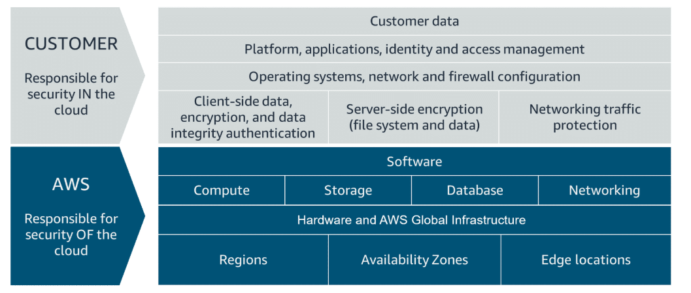
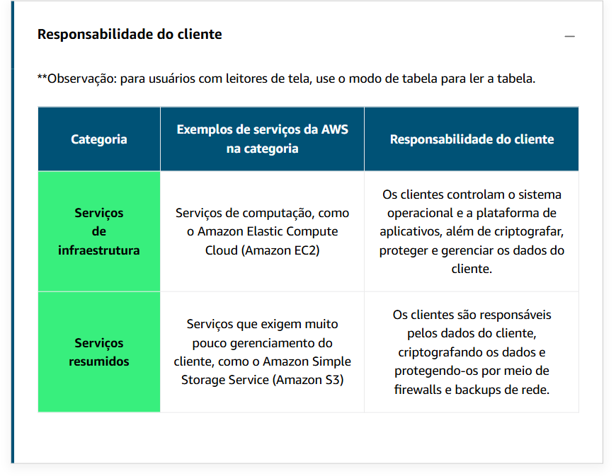
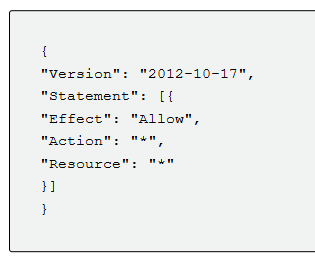

# Modelo de implemetação em Nuvem

---

### On-premises (no local) | Cloud (nuvem) | Hybrid   (hibrido)

---

### On-premises (no local)

Antes da nuvem, empresas e organizações hospedavam e mantinham hardware, como computação, armazenamento e equipamentos de rede em seus próprios data centers. 

---

### Cloud 

È a entrega sob demanda de recursos de TI com preços principalmente pré-pagos.

Empresas como a Amazon Web Services (AWS) possuem e mantêm data centers e fornecem tecnologias e serviços de data center virtual para empresas e usuários pela Internet.

---

### Hybrid

Esse tipo de implantação é uma maneira de conectar infraestrutura e aplicativos entre recursos baseados em nuvem e recursos existentes que não estão localizados na nuvem.

---

### On-premises VS Cloud 

 Em uma solução local, um ambiente adicional exige que você compre e instale hardware, conecte o cabeamento necessário, provisione energia, instale sistemas operacionais e muito mais.

 Por outro lado, ao executar seu aplicativo na nuvem, você pode replicar um ambiente de produção inteiro em questão de minutos ou até segundos.

 ---

  

# Infraestrutura global da AWS

### A infraestrutura existe como a base de todos os aplicativos em nuvem.

A AWS tem clusters de datacenters em todo o mundo.  Esse cluster de data centers é chamado de zona de disponibilidade ou AZ.

como você escolhe uma região da AWS? Como regra básica, há quatro aspectos que você precisa considerar ao decidir qual região da AWS usar: conformidade, latência, preço e disponibilidade do serviço.

Observando a conformidade, a latência, os preços e a disponibilidade do serviço.

A latência tem tudo a ver com a proximidade de seus recursos de TI com sua base de usuários.

os serviços que deseja usar. 

### `Escolher a região da AWS certa`

Ao decidir qual região da AWS hospedar seus aplicativos e cargas de trabalho, considere quatro aspectos principais: latência, preço, disponibilidade do serviço e conformidade.

---

### `Zonas de disponibilidade`

As zonas de disponibilidade também têm nomes de código. Como eles estão localizados dentro de regiões, eles podem ser endereçados anexando uma letra ao final do nome do código da região. Aqui estão exemplos de códigos de zona de disponibilidade:

us-east-1a é uma zona de disponibilidade em us-east-1 (região do Norte da Virgínia).
sa-east-1b é uma Zona de Disponibilidade em sa-east-1 (Região de São Paulo).

---

### `Escopo dos serviços da AWS`

Ao operar um serviço com escopo de região, você só precisa selecionar a região que deseja usar. Se você não for solicitado a especificar uma zona de disponibilidade individual para implantar o serviço, esse será um indicador de que o serviço opera em um nível de escopo de região. Para serviços com escopo de região, a AWS executa automaticamente ações para aumentar a durabilidade e a disponibilidade dos dados.

---

### `Mantendo a resiliência`

No mínimo, você deve usar duas zonas de disponibilidade. Dessa forma, se uma zona de disponibilidade falhar, seu aplicativo terá a infraestrutura em execução em uma segunda zona de disponibilidade para assumir o tráfego.

---

### `Locais de Borda`

Os pontos de presença são locais globais onde o conteúdo é armazenado em cache. Isso possibilitaria que seus clientes acessassem os vídeos ou serviços em cache mais rapidamente do que acessá-los de outro pais.

Quando um usuário solicita conteúdo que está sendo fornecido com o CloudFront, a solicitação é roteada para o local que fornece a menor latência. Para que o conteúdo seja entregue com o melhor desempenho possível. 

---

  

# Interação com a AWS

#### Cada ação que você faz na AWS é uma chamada de API autenticada e autorizada.

Quando eu crio, excluo ou altero qualquer recurso da AWS, seja um servidor virtual ou um sistema de armazenamento para fotos de funcionários, eu uso chamadas de API para a AWS para fazer isso.

API de várias maneiras, mas as três principais maneiras:

-   Console de Gerenciamento da AWS

-   Interface da Linha de Comando da AWS

-   Kits de Desenvolvimento de Software da AWS, ou SDKs

Para recapitular, você tem três opções principais para se conectar à AWS, o console, a CLI e os SDKs.

Cada ação que você faz na AWS é uma chamada de API autenticada e autorizada. Na AWS, você pode fazer chamadas de API para serviços e recursos por meio do Console de Gerenciamento da AWS, da AWS Command Line Interface (AWS CLI) ou dos SDKs da AWS.

---

### `Console de gerenciamento da AWS`

Uma maneira de gerenciar os recursos da nuvem é por meio do console baseado na web, onde você faz login e escolhe o serviço desejado. Essa pode ser a maneira mais fácil de criar e gerenciar recursos quando você começa a trabalhar com a nuvem. 

Se você escolher e alterar a Região, fará solicitações aos serviços da Região escolhida. O URL também muda. Alterar a configuração Region direciona seu navegador para fazer solicitações para uma região da AWS diferente, representada por um subdomínio diferente.

---

### `AWS CLI`

pode programar um script da AWS CLI com uma chamada de API para extrair esses dados para você.

AWS CLI é uma ferramenta unificada que você pode usar para gerenciar serviços da AWS. Você pode baixar e configurar uma ferramenta que pode ser usada para controlar vários serviços da AWS a partir da linha de comando e automatizá-los com scripts.

---

### `AWS SDKs`

As chamadas de API para a AWS também podem ser `executadas` executando código `com linguagens de programação`. Você pode `fazer isso usando os SDKs da AWS`.

---

  

# Segurança e o modelo de responsabilidade compartilhada da AWS

Quando você trabalha com a Nuvem AWS, o gerenciamento da segurança e da conformidade é uma responsabilidade compartilhada entre a AWS e você. Para descrever essa responsabilidade compartilhada.

### `Responsabilidade da AWS`

-   Proteção e segurança de regiões, zonas de disponibilidade e datacenters da AWS, até a segurança física dos edifícios

-   Gerenciar os componentes de hardware, software e rede que executam os serviços da AWS, como servidores físicos, sistemas operacionais host, camadas de virtualização e componentes de rede da AWS

### `Responsabilidade do cliente`

clientes são responsáveis pela segurança na nuvem. Ao utilizar qualquer serviço da AWS, o cliente é responsável por configurar adequadamente o serviço e suas aplicações, além de garantir que seus dados estejam seguros.

Um conceito-chave é que os clientes mantêm o controle total de seus dados e são responsáveis por gerenciar a segurança relacionada ao seu conteúdo. Por exemplo, você é responsável pelo seguinte:

-   Escolher uma região para recursos da AWS de acordo com os regulamentos de soberania de dados.

-   Implementação de mecanismos de proteção de dados, como criptografia e backups programados.

-   Usar o controle de acesso para limitar quem pode acessar seus dados e recursos da AWS.

---

  

# Protecting the AWS Root User

#### Ao acessar a AWS pela primeira vez, você começa com uma identidade de login único conhecida como usuário raiz.

---

O usuário raiz da AWS tem dois conjuntos de credenciais associadas a ele. 

Um conjunto de credenciais é o endereço de e-mail e a senha que foram usados para criar a conta.

O segundo é chamado de chaves de acesso, que permitem fazer solicitações (AWS CLI) ou da API da AWS.

As teclas de acesso consistem em duas partes:

-   ID da chave de acesso: por exemplo, A2lAl5EXAMPLE
-   Chave de acesso secreta: por exemplo, wJalrFE/KbEKxE

---

  

# Gerenciamento de identidade e acesso da AWS

##### A autenticação responde à pergunta: "Você é quem diz ser?" A autorização responde à pergunta: "Quais ações você pode executar?"

### `Autenticação e autorização`

#### Autenticação

-   Se um usuário digitar o endereço de e-mail e a senha corretos, o sistema assumirá que o usuário tem permissão para entrar e concederá acesso a ele. A autenticação garante que o usuário seja quem diz ser.

### `Autorização`

-   A autorização é o processo de conceder aos usuários permissão para acessar recursos e serviços da AWS. A autorização determina se um usuário pode executar determinadas ações.

### `O que é IAM?`

O AWS Identity and Access Management (IAM) é um serviço da AWS que ajuda você a gerenciar o acesso à sua conta e recursos da AWS. Ele também fornece uma visão centralizada de quem e o que é permitido dentro de sua conta da AWS (autenticação) e quem e o que tem permissões para usar e trabalhar com seus recursos da AWS (autorização).

### `Usuário do IAM`

Um usuário do IAM representa uma pessoa ou serviço que interage com a AWS. Você define o usuário em sua conta da AWS. Qualquer atividade realizada por esse usuário é cobrada em sua conta. Quando você cria um usuário, ele pode fazer login para obter acesso aos recursos da AWS dentro da sua conta.

As credenciais de usuário do IAM são consideradas permanentes, o que significa que elas permanecem com o usuário até que haja uma alternância forçada pelos administradores.

### `Grupos do IAM`

Um grupo do IAM é uma coleção de usuários. Todos os usuários do grupo herdam as permissões atribuídas ao grupo. Isso torna possível conceder permissões a vários usuários ao mesmo tempo.

<u> Lembre-se dos seguintes recursos dos grupos: </u>

-   Os grupos podem ter muitos usuários.
-   Os usuários podem pertencer a muitos grupos.
-   Os grupos não podem pertencer a grupos.

### `Políticas do IAM`

A maioria das políticas é armazenada na AWS como documentos JSON com vários elementos de política.

Essa política tem quatro elementos JSON principais: Versão, Efeito, Ação e Recurso.

-   O elemento Version define a versão da linguagem da política

-   O elemento Effect especifica se a política permitirá ou negará acesso. 

-   O elemento Action descreve o tipo de ação que deve ser permitida ou negada.

-   O elemento Resource especifica o objeto ou objetos que a instrução de política cobre. 

---

  

# Hospedagem do aplicativo de diretório de funcionários na AWS

