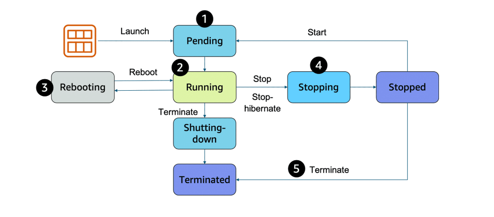
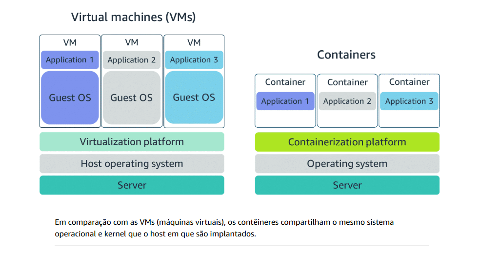

# Computação como serviço

#### Em um nível fundamental, três tipos de opções de computação estão disponíveis: VMs (máquinas virtuais), serviços de contêiner e sem servidor.

### `Servidores`

Um servidor que lida com as solicitações é um computador, ou conjunto de computadores, conectado à Internet que serve sites para usuários da Internet.

Para contextualizar, os servidores HTTP comuns incluem o seguinte:

-   Opções do Windows, como Serviços de Informações da Internet (IIS)

-   Opções do Linux, como Apache HTTP Server, Nginx e Apache Tomcat

Para executar um servidor HTTP na AWS, você deve encontrar um serviço que forneça poder computacional no Console de Gerenciamento da AWS.

---

# `Escolhendo a opção de computação certa`

Em um nível fundamental, três tipos de opções de computação estão disponíveis: VMs (máquinas virtuais), serviços de contêiner e sem servidor.

---

  

# Conceitos básicos do Amazon EC2

#### Ao arquitetar qualquer aplicativo para alta disponibilidade, considere usar pelo menos duas instâncias do EC2 em duas zonas de disponibilidade separadas.

### `Amazon EC2`

O Amazon EC2 é um serviço da web que fornece capacidade computacional segura e redimensionável na nuvem. Com esse serviço, você pode provisionar servidores virtuais chamados instâncias do EC2.

Com o Amazon EC2, você pode fazer o seguinte:

-   Provisione e execute uma ou mais instâncias do EC2 em minutos.

-   Interrompa ou desligue instâncias do EC2 quando terminar de executar uma carga de trabalho.

-   Pague por hora ou segundo para cada tipo de instância (mínimo de 60 segundos).

Para criar uma instância do EC2, você deve definir o seguinte:

-   Especificações de hardware: CPU, memória, rede e armazenamento

-   Configurações lógicas: Local de rede, regras de firewall, autenticação e o sistema operacional de sua escolha

---

### `Imagem da máquina da Amazon`

Na Nuvem AWS, a instalação do sistema operacional não é de sua responsabilidade. Em vez disso, ele é integrado à AMI que você escolher. 

Uma AMI inclui o sistema operacional, o mapeamento de armazenamento, o tipo de arquitetura, as permissões de inicialização e quaisquer aplicativos de software pré-instalados adicionais.

---

### `Relacionamento entre AMIs e instâncias do EC2`

Nesse caso, a AMI é como você modela e define sua instância. A instância do EC2 é a entidade com a qual você interage, onde você pode instalar seu servidor web e fornecer seu conteúdo aos usuários.

---

### `Tipos de instância do Amazon EC2`

As instâncias do EC2 são uma combinação de processadores virtuais (vCPUs), memória, rede e, em alguns casos, armazenamento de instâncias e unidades de processamento gráfico (GPUs). Ao criar uma instância do EC2, você precisa escolher quanto precisa de cada um desses componentes.

-   Primeira posição – A primeira posição, c, indica a família de instâncias. Isso indica que essa instância pertence à família otimizada para computação.

-   Segunda posição – A segunda posição, 5, indica a geração da instância. Esta instância pertence à quinta geração de instâncias.

-   Cartas restantes antes do período - Nesse caso, n indica atributos adicionais, como armazenamento NVMe local.

-   Após o período – Após o período, xlarge indica o tamanho da instância. Neste exemplo, é xlarge.

---

### `Locais de instância do EC2`

A menos que especificado de outra forma, quando você executa instâncias do EC2, elas são colocadas em uma nuvem privada virtual (VPC) padrão. A VPC padrão é adequada para começar rapidamente e executar instâncias públicas do EC2 sem precisar criar e configurar sua própria VPC.

Qualquer recurso que você colocar dentro da VPC padrão será público e acessível pela Internet, portanto, você não deve colocar dados de clientes ou informações privadas nele.

--- 

  

# Ciclo de vida da instância do Amazon EC2

#### 
Uma instância do EC2 faz a transição entre diferentes estados desde o momento em que você a cria até seu encerramento.

--- 

  

# Serviços de contêiner

#### Não existe um serviço de computação de tamanho único porque depende de suas necessidades. A chave é entender o que cada opção oferece.

### `Recipientes`

Um contêiner é uma unidade padronizada que empacota seu código e suas dependências. Este pacote foi projetado para ser executado de forma confiável em qualquer plataforma, pois o contêiner cria seu próprio ambiente independente.

Com contêineres, as cargas de trabalho podem ser transportadas de um lugar para outro, como do desenvolvimento para a produção ou de ambientes locais para a nuvem.

---

### `Diferença entre VMs e contêineres`

---

### `Orquestrando contêineres`

Se você estiver tentando gerenciar sua computação em grande escala, considere o seguinte:

-   Como colocar seus contêineres em suas instâncias

-   O que acontece se o contêiner falhar

-   O que acontece se sua instância falhar

-    Como monitorar implantações de seus contêineres

--- 

### `Gerenciamento de contêineres com o Amazon ECS`

Com o Amazon ECS, seus contêineres são definidos em uma definição de tarefa que você usa para executar uma tarefa individual ou uma tarefa dentro de um serviço.

Quando as instâncias de contêiner do Amazon ECS estão em execução, você pode executar ações que incluem, entre outras, o seguinte:

-   Lançamento e parada de contêineres
-   Obtendo o estado do cluster
-   Escalando e reduzindo horizontalmente
-   Programando o posicionamento de contêineres em seu cluster
-   Atribuindo permissões
-   Atendendo aos requisitos de disponibilidade 

---

### `Usar o Kubernetes com o Amazon EKS`

O Kubernetes é uma plataforma portátil, extensível e de código aberto para gerenciar cargas de trabalho e serviços em contêineres. 

O Amazon EKS é conceitualmente semelhante ao Amazon ECS, mas com as seguintes diferenças:

-   No Amazon ECS, a máquina que executa os contêineres é uma instância do EC2 que tem um agente do ECS instalado e configurado para executar e gerenciar seus contêineres. Essa instância é chamada de instância de contêiner. No Amazon EKS, a máquina que executa os contêineres é chamada de nó de processamento ou nó do Kubernetes.

-   Um contêiner do ECS é chamado de tarefa. Um contêiner do EKS é chamado de pod.

-   ;O Amazon ECS é executado na tecnologia nativa da AWS. O Amazon EKS é executado no Kubernetes.